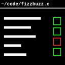

# CPTerm



CPTerm is a Firefox and Chrome extension that brings competitive programming
problems from LeetCode and HackerRank to your favorite code editor.

## Features

- Sync your solutions from any editor to the browser, ditching clunky
browser-based editors
- Export problem statements to PDF or HTML, or another format using Pandoc or
LibreOffice
- Load past solutions from your filesystem
- Submit your code and run test cases from external scripts
- Run scripts when opening problems

## Installation

### Requirements

- **Firefox >=128**, or **Chrome/Chromium >=131**
- [**Java 8**](https://www.java.com/) or newer

### Install native messaging host

The CPTerm host is a Java application distributed as a `jar` file.

<details>
<summary>Troubleshooting</summary>
Ensure that the <code>java</code> binary of the JRE is in your
<code>PATH</code>.  This should happen by default if you used an installer or
your Linux distribution's package manager, but run <code>java -version</code> in
a terminal or command prompt to make sure.  Additionally, the system-wide JRE
will be used to run the host itself.
</details>

#### CLI installer

Run the command:
```
java -jar cpterm-XXX.jar -b BROWSER [-b BROWSER...] [-d DIRECTORY]
```
where BROWSER is one of `firefox`, `chrome`, or `chromium` and DIRECTORY is the
install directory, set to a reasonable default for your OS if not specified.
Multiple browsers can be specified.

#### GUI installer

Run the `jar` by either double-clicking it or running `java -jar cpterm-XXX.jar`
where `XXX` is the version.  Select the browser(s) you plan to use with CPTerm
and leave the location as the default unless you know what you are doing.

### Install extension

AMO and Chrome Web Store links may be coming soon.

### Build extension

You must have `node` and `npm` installed.  In the `extension` directory, run the
commands:
```
npm install
npm run build
npm run zip:firefox
npm run zip:chrome
```
This will produce `cpterm-firefox.zip` and `cpterm-chrome.zip` files in the
`extension/dist` directory, which can be used to install the extension.

### Build host

You must have Maven installed.  In the `host` directory, run:
```
mvn clean build
```

## Basic usage

Each time you load a page of a supported website, the `Open problem` button will
appear in the upper-left corner.  `Alt`-`Shift`-`C` is a shortcut for this
button.  If the page is a problem page, clicking the button will, in this order:

- run the pre-problem script (if enabled)
- render the problem statement to a file (if enabled);
- create a new, or read an existing, problem code file;
- listen on the filesystem for changes to the problem code file; and
- run the post-problem script (if enabled)

A problem being _open_ means the [file listener](#code-file) is running for, and
[submissions](#controlling-cpterm) will be made to, that problem.  Only one
problem can be opened at a time.

## Files

The two main files for a problem are the code file and problem statement file.
These can be organized in a **problem directory**, but temporary files are used
by default.  When a problem directory path is set by the user, a sub-directory
is created inside it for each problem.  Each sub-directory is named according to
the problem's name.

### Code file

This file contains your solution.  It is created by CPTerm when you open a
problem for the first time, and is initially populated with the template code
provided by the website.  If you are using a problem directory and the problem
has been opened before (i.e., there exists a sub-directory with the problem
name), the old code file will be read into the web-based editor.  Changes to
this file are monitored by CPTerm and synced to the web-based editor.

### Problem statement file

This file contains the problem description and short examples provided by the
website.  It ideally does not contain editorials, discussions, test cases, or
anything else on the problem page.  Since it's scraped from the page `HTML`,
behavior may change slightly with updates to the websites.

Because the problem statement is in `HTML`, and typically a more readable format
is desired, this file can be rendered using one of three tools.  By default, the
Java library [Open HTML to PDF](https://github.com/openhtmltopdf/openhtmltopdf)
is used to render to `PDF`, and this is the best option for most users since it
works out of the box.  If a different file type is desired, support also exists
for [Pandoc](https://pandoc.org/) and
[LibreOffice](https://www.libreoffice.org/), which will need to be installed
separately if you want to use them.  When using either of these tools, CPTerm
will render `SVG` graphics in the problem statement to `PNG` since they both
don't support `SVG` well enough.  If `HTML` is actually the desired output,
CPTerm can produce a cleaned `HTML` file, optionally with `SVG` rendered to
`PNG`.

### Test case files

These are generated when running a test case from CPTerm (this process is
described later).  Typically, three files are created: input, output, and
expected output.  An error file may be created if there was a compile time or
runtime error, and this may or may not be accompanied by an input file.  Files
created by a test case are always temporary.

## Scripting

### Hook scripts

CPTerm can invoke pre- and post-problem scripts, which are run when the `Open
problem` button is clicked, and after the problem files have been created and
opened, respectively.  The post-problem script is passed two command line
arguments: the absolute paths to the code file and the problem statement file
(if it exists).

### Controlling CPTerm

A TCP server can be run so that CPTerm can be controlled externally; the server
only accepts loopback connections.  By default, it is disabled.  The TCP server
can be used to _run_ and _submit_ your solution.  This verbiage aligns with that
of at least LeetCode and HackerRank; each of these actions corresponds to some
equivalent functionality on the challenge website.

#### Using `cpt`

The included shell script [cpt](util/cpt) implements a simple client for CPTerm
and should suffice for most users.  It requires any implementation of
[`nc`](https://en.wikipedia.org/wiki/Netcat).  The script is invoked with `cpt
run` or `cpt submit`, and it will format the test case output nicely, if there
is any.  The port number will need to be adjusted in the script if you change it
in CPTerm's settings.

#### Using your own client

To _run_ or _submit_ your solution, connect to the TCP server and send one of
those words followed by a line break.  On Linux/Unix, you can use `nc` to do
this, e.g.:
```
echo submit | nc 127.0.0.1 50000
```

The server's response will be one of the following:

- **Tab-separated columns**
  - Each column is a path to a text file.
  - **3 columns**: input, output, expected
  - **2 columns**: error, input
  - **1 column**: error
- **`timed out`**
  - The action was attempted, but the scraper didn't send a meaningful response
  within 1 minute.
- **Blank**
  - Something went wrong, or no test cases were provided.  LeetCode doesn't show
  any test cases when _submitting_ a problem which passed all hidden test cases.